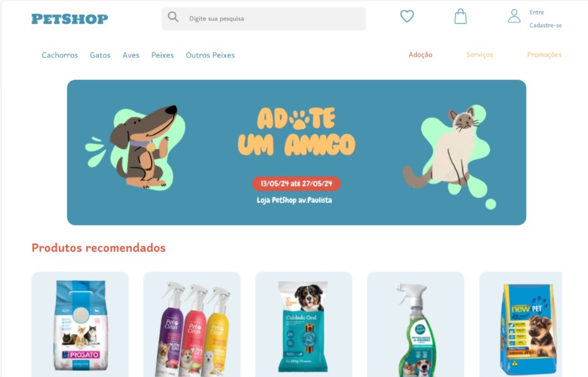

# PETSHOP

## Integrantes do Grupo

- Arthur Abonizio – 555506
- Enzo Dias - 558225
- Gustavo Henrique – 556712
- Milena Garcia – 555111
- Steffany Medeiros – 556262

## Descrição do Projeto

Este é um projeto de site para petshop desenvolvido em HTML, CSS e JavaScript. O site inclui um slideshow e é responsivo para dispositivos móveis. O objetivo é proporcionar uma experiência amigável e acessível para os usuários, oferecendo uma variedade de produtos e serviços para pets, além de promover campanhas de adoção.

## Funcionalidades

- **Homepage**: Página inicial com slideshow de promoções e campanhas.
- **Categorias de Produtos**: Sessões específicas para cachorros, gatos, aves, peixes e outros pets.
- **Serviços**: Informações sobre serviços oferecidos, como banho e tosa.
- **Adoção**: Seção dedicada à adoção de pets, com detalhes de eventos e campanhas.
- **Responsividade**: Design responsivo para uma experiência otimizada em dispositivos móveis.

## Tecnologias Utilizadas

- **HTML**: Estruturação do conteúdo do site.
- **CSS**: Estilização e design do site.
- **JavaScript**: Interatividade, incluindo o slideshow e outras funcionalidades dinâmicas.
